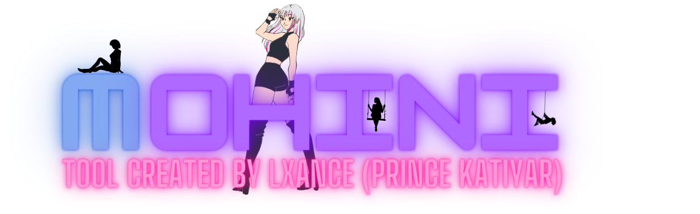
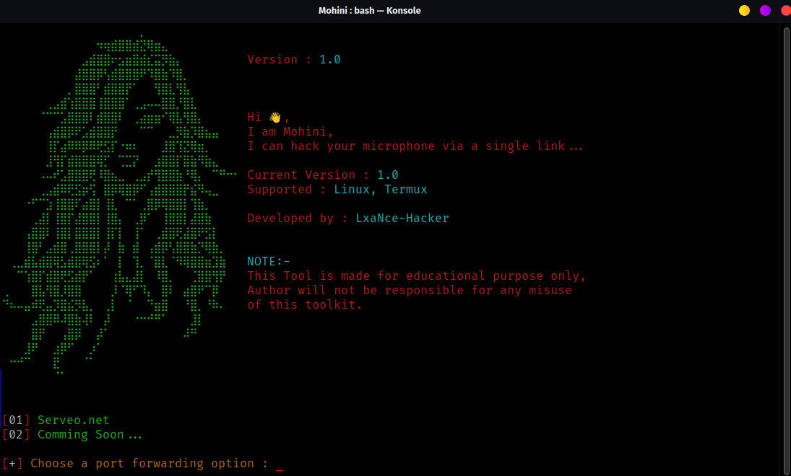

# Mohini
Mohini is a online real time hacking tool which is used for Capturing audio (.wav) from target via a link 😉,

### THIS TOOL IS CREATED FOR EDUCATIONAL PURPOSE, DON'T MISUSE IT.
<p align="center">
  
</p>

### How it works?

After the user grants microphone permissions, a website redirect button of your choice is released to distract the target while small audio files (about 4 seconds in wav format) are sent to the attacker.
It uses Recorderjs, plugin for recording/exporting the output of Web Audio API nodes (https://github.com/mattdiamond/Recorderjs)

### Features:

Port Forwarding using Serveo or Ngrok

## Legal disclaimer:

Usage of Mohini for attacking targets without prior mutual consent is illegal. It's the end user's responsibility to obey all applicable local, state and federal laws. Developers assume no liability and are not responsible for any misuse or damage caused by this programme

## Installing Process 👇
```$ git clone https://github.com/LxaNce-Hacker/Mohini```<br>
## Running Process 👇
```$ cd Mohini```<br>
```$ bash Mohini.sh```<br>

## Workflow 👇
<br>
<p align="center">
  
</p>-->
